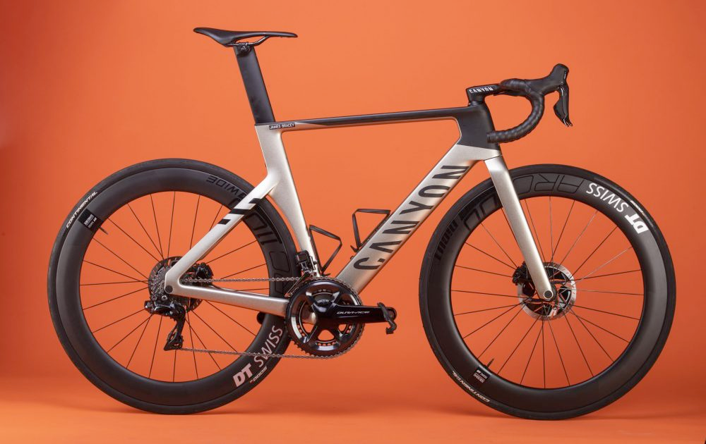

# Help

This is a help space

***


This is a super useful hint.  Go ahead and get it&#x20;



> I am not sure if this is for me



This is the first tab&#x20;



<mark style="color:purple;">**This is the bold**</mark>


