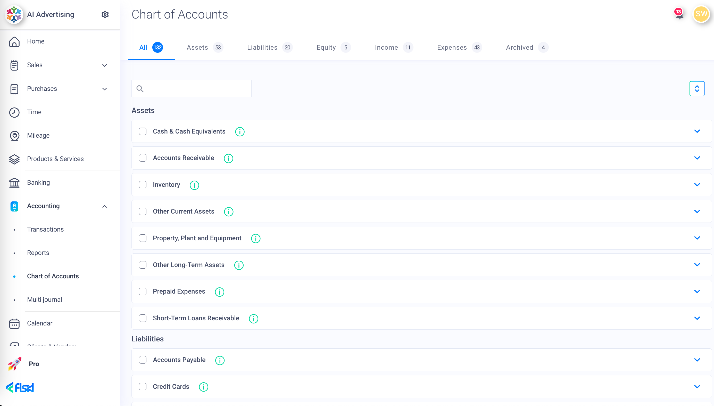

# Chart of Accounts

### Chart of Accounts guide <a href="#kbsection0" id="kbsection0"></a>

A Chart of Accounts is key to your bookkeeping, accounting, and reporting. It’s like a map that helps you categorise your transactions correctly and group similar accounts together for reporting and analysis.

The Chart of Accounts (CoA) in Fiskl can be filtered by account type as well as displaying the list of all accounts.

You can access your chart of accounts using the left menu [https://my.fiskl.com/accounting/chart](https://my.fiskl.com/accounting/chart)\



```
Left menu > Accounting > Chart of Accounts
```


<figure><figcaption></figcaption></figure>

### The CoA is split across the following five main account types:

## **Assets**

Assets are anything of value that your business owns. An asset can be something tangible like cash, a bank account, property, or a piece of equipment. Or it can be something intangible, like patents, copyrights, or trademarks.

Examples of common asset accounts include bank accounts like checking or savings accounts, inventory, buildings or equipment, and accounts receivable, which is money your business is owed by customers for products or services you’ve provided.

Assets are recorded on the Balance Sheet and are categorized based on their nature, usage, and liquidity.

## **Liabilities**

Liabilities are any debts your company has, whether it’s bank loans, mortgages, unpaid bills, sales taxes or any other sum of money that you owe someone else. A liability is if you’ve promised to pay someone a sum of money in the future and haven’t paid them yet.

These accounts are recorded on the Balance Sheet and are classified as either current liabilities or non-current liabilities based on their expected repayment timeline.

## **Equity**

Equity accounts, also known as shareholders’ equity or owner’s equity are reported on the Balance Sheet and represent the company’s net worth or book value. In other words, equity represents the difference between your assets and liabilities. It is what would be left over if you sold all your business assets and paid all your debt.

Increases in equity result from profitable operations, capital contributions by shareholders, or favorable changes in the value of assets held by the company. On the other hand, losses, dividend payments, and share repurchases decrease equity.

## **Income**

Income categories show how much a company has earned. A debit to an income account reduces that amount and a credit to an income account increases income for the company. Income accounts in accounting represent the revenue or income generated by a company through its primary business activities. These accounts capture the inflow of economic benefits resulting from the sale of goods, provision of services, or other revenue-generating activities. Income accounts are recorded on the Income Statement and contribute to the calculation of net income or profit.

## **Expenses**

Expense categories show how much a company has spent. A debit to an expense account increases company expenses and a credit to an expense account reduces it.

Expense accounts in accounting represent the costs incurred by a company in its normal business operations. These costs are necessary for generating revenue and maintaining the day-to-day operations of the business. Expense accounts are recorded on the Income Statement and are subtracted from revenue to calculate net income or loss.

A well-structured and properly maintained Chart of Accounts is crucial for effective financial management and decision-making. Fiskl provides a comprehensive selection of the most used accounts, it’s also easy to add more categories based on your own business needs. By organising financial data in a systematic manner, it enables businesses to accurately report their financial position and performance. Understanding the purpose, structure, and benefits of a Chart of Accounts is essential for establishing sound accounting practices and ensuring the availability of reliable financial information
